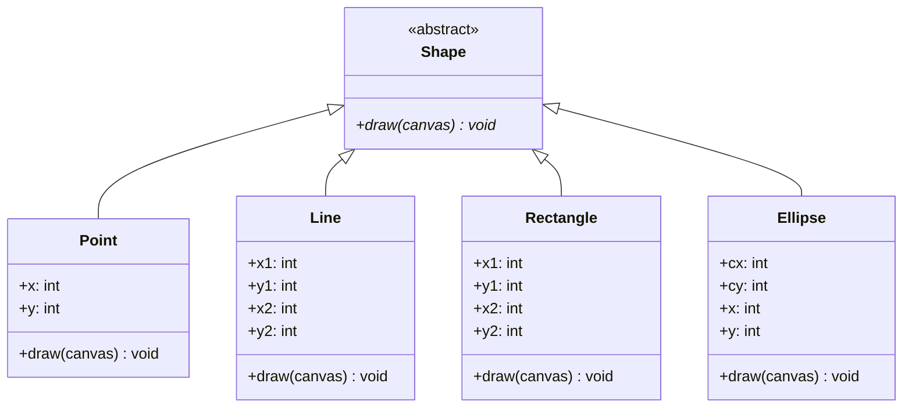

```mermaid
classDiagram
    class Shape {
        <<abstract>>
        +draw(canvas)* void
    }

    class Point {
        +x: int
        +y: int
        +draw(canvas) void
    }

    class Line {
        +x1: int
        +y1: int
        +x2: int
        +y2: int
        +draw(canvas) void
    }

    class Rectangle {
        +x1: int
        +y1: int
        +x2: int
        +y2: int
        +draw(canvas) void
    }

    class Ellipse {
        +cx: int
        +cy: int
        +x: int
        +y: int
        +draw(canvas) void
    }

    Shape <|-- Point
    Shape <|-- Line
    Shape <|-- Rectangle
    Shape <|-- Ellipse
```
