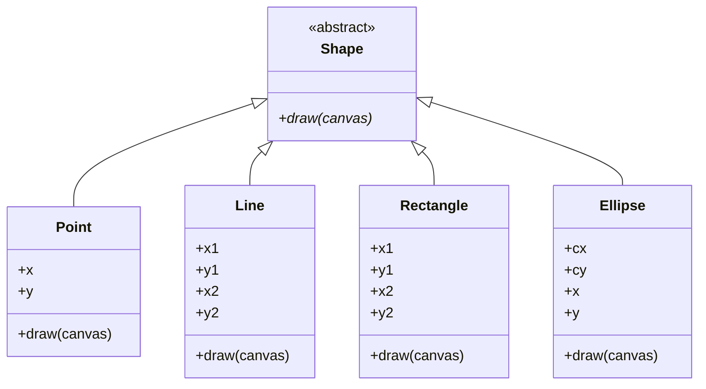

```mermaid
classDiagram
    direction TB

    class Shape {
        <<abstract>>
        +draw(canvas)*
    }

    class Point {
        +x
        +y
        +draw(canvas)
    }

    class Line {
        +x1
        +y1
        +x2
        +y2
        +draw(canvas)
    }

    class Rectangle {
        +x1
        +y1
        +x2
        +y2
        +draw(canvas)
    }

    class Ellipse {
        +cx
        +cy
        +x
        +y
        +draw(canvas)
    }

    Shape <|-- Point
    Shape <|-- Line
    Shape <|-- Rectangle
    Shape <|-- Ellipse
```
